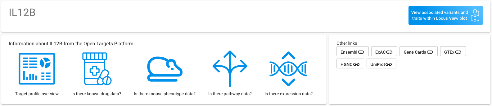
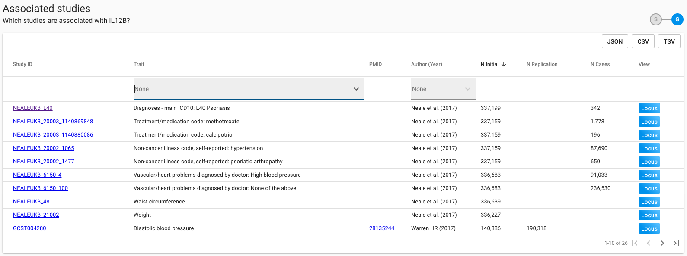

# A Gene


**Search by a Gene**  **to:**

1. Identify loci which functionally implicate a gene
2. Link out to detailed information on the gene and drugs targeting it 
3. Identify which traits this gene may play a role in, based on variants to which it is assigned


## You Will See

### Gene Meta-data

Details of the gene, including link-outs to interrogate the gene in the OT Platform and through other external providers. Click through the link to load the Locus View for the gene, with the queried gene pre-selected.

### Associated Studies

Table summarises published studies and UKB phenotypes with which the queried gene is connected in the OT Genetics pipeline. A gene is connected to a trait in cases where the gene has been functionally assigned to a locus associated with this trait, either via the $$V_L$$ or an assigned proxy $$V_T$$. Each GWAS Study is linked out via PubMed. UK Biobank traits \(Neale _et al_\) do not have a PubMed record. Clicking a Study ID will redirect to the study's page, details of which can be seen here. The table can be sorted by column, filtered by column using the drop-downs, and downloaded in flat and nested formats.

To identify loci and functional variants through which the gene is implicated in a chosen trait, click through to view the Locus Plot. The queried gene, the corresponding $$V_L$$ through which it is associated with the chosen trait, and the $$V_T$$ through which this lead functionally implicates the gene, will be pre-selected when the plot is loaded.

