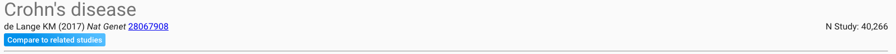
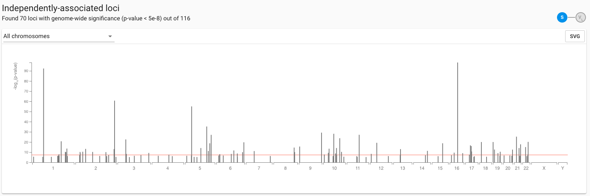
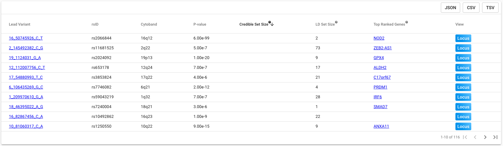

# A Study \(Trait\)


Search by a **Study**to: 

1. View loci associated with a trait in the selected study
2. Identify prioritised genes functionally implicated by each locus
3. View 95% credible sets \(where available\) and proxies at each locus


### You Will See

#### Study Meta-data

Summarises the details of the selected study, including the maximal N and link-outs to the PubMed record.  Selecting 'Compare to Related Studies' allows you to check for overlap between loci reported by this study, and loci for other traits either prioritised by Open Targets Genetics based on shared architecture, or selected manually by the user.  Details on this feature can be found here.

#### Independently-Associated Loci

Loci reported by the selected study are displayed in a simplified Manhattan view, with the line of genome-wide significance highlighted red.  Our methods for locus definition are detailed here.  Hover over a locus to view its details, including the top-ranked gene for the locus according to the Open Targets Genetics pipeline.  Selecting a chromosome using the drop-down or by clicking the chromosome number on the x-axis will expand and zoom the view of loci located on that chromosome, and restrict the loci details displayed in the accompanying table, below.  Options to download the plot as a vector are provided.

Full details of each locus are summarised in the table below the Manhattan view.  Results can be sorted by a single column by clicking the corresponding header, and further details on column contents are displayed when hovering over the header '?' icon.  Various download options for the full table contents are available.  The top-ranked gene is defined as the gene with the largest weight of functional evidence across all sources and cell types linking it to the specified locus either directly or via a $$V_T$$.  If more than one gene is scored equally at this locus, all genes with the maximum score are shown.  If the selected study has full sumstats available, the credible set size for each locus is displayed alongside the number of  $$V_T$$ defined by LD with the lead.

Clicking the lead variant or top gene links will redirect to the corresponding variant or gene entity page.  To view the Locus Plot with the corresponding $$V_L$$, gene and study selected, click through the 'Locus' button. 

