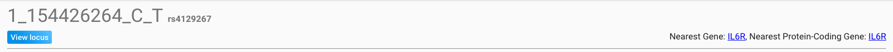
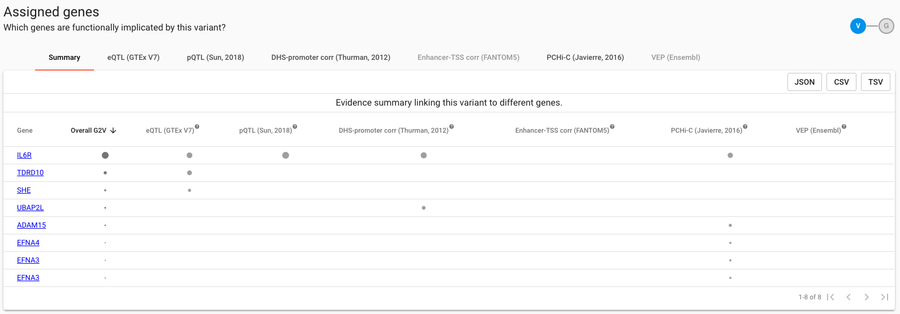
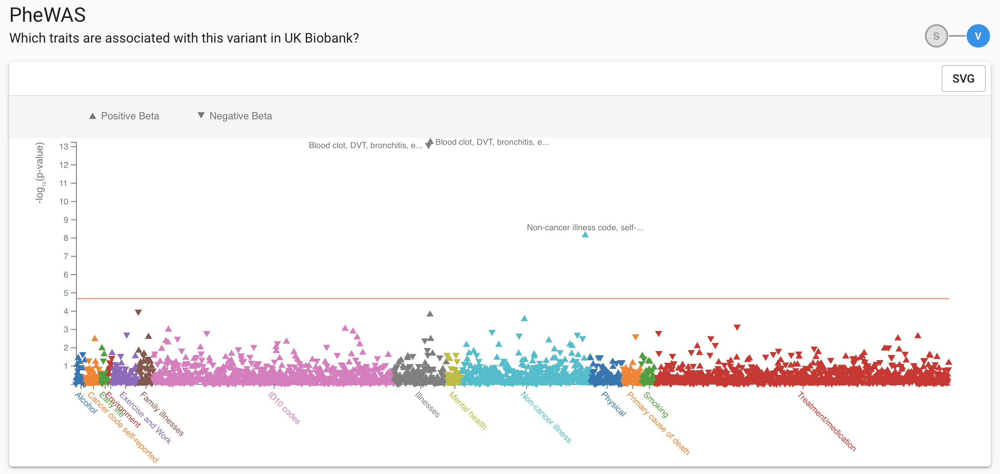
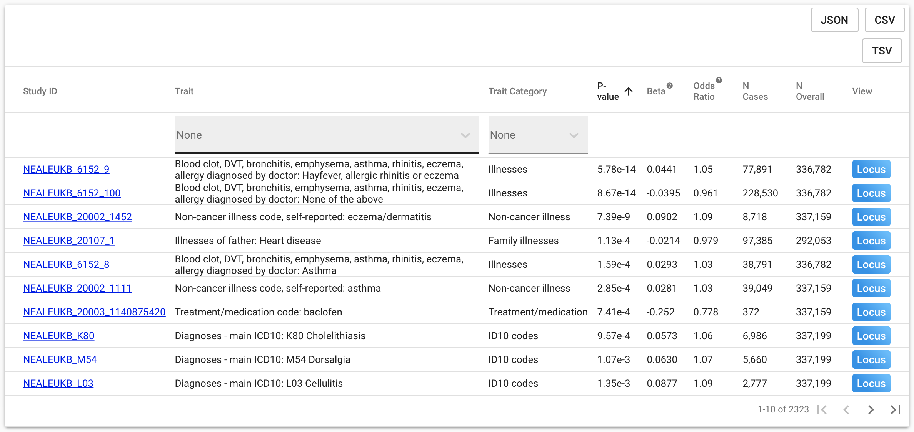

# A Variant


Search by a Variant  or  to:

1. Identify a ranked list of genes which are functionally implicated by the variant
2. View and dissect the functional data by which genes are assigned to this variant
3. View PheWAS results for the variant in UK Biobank
4. View linkage structure around the variant


Whether a variant is a lead or tag cannot be specified whilst searching - simply enter the variant of interest using an rsID or chromosome position e.g. 1\_154426264\_C\_T.  When entering a variant in the chromosome position format, options corresponding to the various allele combinations  at the locus will be displayed in the search drop-down. There will be slight differences in the returned variant page for lead and tag variants.


All variants in Open Targets Genetics are notated using the format `chr_pos_ref_alt`, where `ref` and `alt` are the reference and alternate alleles as defined by Ensembl.  Coordinates are relative to the GRCh37 assembly also known as hg19.


### You Will See

#### Variant Meta-data

Overall identifying information for the variant, including its rsID if assigned, nearest gene and nearest protein-coding gene according to GRCh37.  Clicking through the 'View Locus' link will load the Locus View, with the variant preselected.  If the variant is a lead variant in any published study or in UKB sumstats, it will be highlighted on the $$V_L$$ track; otherwise it will be selected as a $$V_T$$entity.  

#### Assigned Genes

Table summarsing the extent of evidence by which the queried variant implicates various genes. The default view summarises the combined evidence for each gene by each functional data source, collapsed across cell types within the data source. Overall G2V is a representation of this combined evidence weighting for each gene - sort descending on this column to rank the column from most- to least-likely 'causal' gene at this locus based on the current evidence base in Open Targets Genetics.  

The presence of a bullet in the table indicates that there is evidence from the given data source linking the gene to the queried variant, in at least one cell type. The radius of each point is proportionate to the relative magnitude of the maximum effect size across all tissues available for the data source, expressed as a quantile.  Details of how the V2G score is calculated and weighted are detailed in 'Our Approach'.

To view tissue-specific evidence within a data source, select the data source from the tabs visible at the top of the table widget.  An equivalent view segregated by cell type rather than data source will be opened, as above for eQTL evidence in each of 44 GTEx tissues.  If evidence from the data source being examined can be interpreted directionally, bullets will be coloured according to the direction of effect:  blue notating a -ve beta, and red a +ve.  Again, the radius of the bullet is proportionate to the beta's magnitude.  Hovering over a bullet will display the underlying beta and p-value represented, as reported by the original data source.  

#### UK Biobank PheWAS

PheWAS results for the selected variant across all UK Biobank phenotypes released by Neale and colleagues are displayed as a PheWAS plot segregated by high-level phenotype grouping, and detailed in an underlying table.  The red line denotes the significance level after Bonferroni correction for the number of phenotypes testing, conservatively considering each as independent. The direction of the plot character arrow corresponds to the beta direction of effect, and points are coloured corresponding to their broad phenotype. Details of the association of each phenotype with the trait of interest are displayed in a table beneath the plot, which can be sorted, filtered on column, and downloaded. A direct locus view link is also provided for each phenotype, which will load the locus view with the variant and UK Biobank trait pre-selected.    

#### Related Variants

Finally, we display two tables dedicated to the genetic architecture of the locus to which the variant of interest belongs - 'GWAS Lead Variants' and 'Tag Variants'.  The former displays all GWAS lead variants \(from either GWAS Catalog or UK Biobank\) to which the queried variant has been assigned as a proxy \(tag\) based on LD or fine-mapping. If the queried variant  is itself a GWAS lead variant, the second table displays all variants which have been assigned as a proxy to it. This table will not be displayed if the variant queried is not a lead variant.  Note that most of the details shown in the 'Tag Variants' table \(for example to PMID and other study meta-data\) refer to the lead variant. Fields referring to the tag variant are clearly denoted. LD refers to the LD between the tag and the lead. The posterior probability corresponds to the likelihood that the tag variant is the causal variant for the trait shown at this disease locus. This data will only be available for UK Biobank traits at present, as its calculation requires full summary statistics.     

