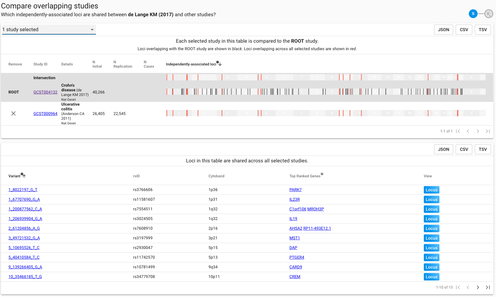

# Multiple Traits or Diseases

From the Study page, multiple studies can quickly be compared to identify overlapping signals.  To navigate to the study comparison view, click through the   button, in the header of the study page of the first study for comparison.

The first study will be loaded into the comparison view as the **root**, with reported loci at genome-wide significance plotted by position.  Studies for comparison can be loaded into the view using the drop-down menu.  Only studies with at least one overlapping locus will be displayed as an option for comparison.  Studies in the drop-down are ordered decreasing on number of overlaps with the loaded root.  When &gt;1 study is loaded, intersecting loci across all of the loaded studies are displayed in red both on the intersection bar at the top of the view, and within each study.  Non-overlapping loci are plotted grey.   

Below the plot view, each overlapping locus across all loaded studies is summarised in a table.  Accessing the locus view from the links in this table will pre-select all of the currently-loaded studies in the generated plot.  The table can be ordered by column and downloaded in a range of flat or nested formats.  Lead variants and genes can be clicked through to view the corresponding entity page.  

Note that the top-ranked genes displayed are the top genes implicated directly by the lead variant shown, and do not take account of genes assigned to any tag variants of the lead.  There may, therefore, be an element of mismatch between the gene shown here and the expected functional gene at the locus.  The locus plot should be used to explore the full range of genes assigned to the locus via the lead variants and their proxies.


In the summary table, only the lead variant from the **root** study is displayed for each overlapping signal.  For example, if there were one overlapping signal across four loaded studies, the table would include one variant:  the lead from the root study.


### How is Overlap Defined?

The comparison view displays pre-calculated locus overlap between all studies currently available in Open Targets Genetics.  To define overlap for a given lead variant $$x$$ , the LD-defined tag variants of $$x$$ are cross-referenced to the tag variants of all lead variants within 5mB of $$x$$.  In any case where a tag variant of $$x$$is shared with another lead variant, that lead is considered part of the same signal as $$x$$.  Each shared locus, therefore, can be considered as a set of signals occupying a common haplotype.    

  

