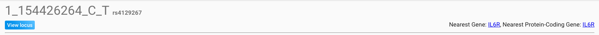
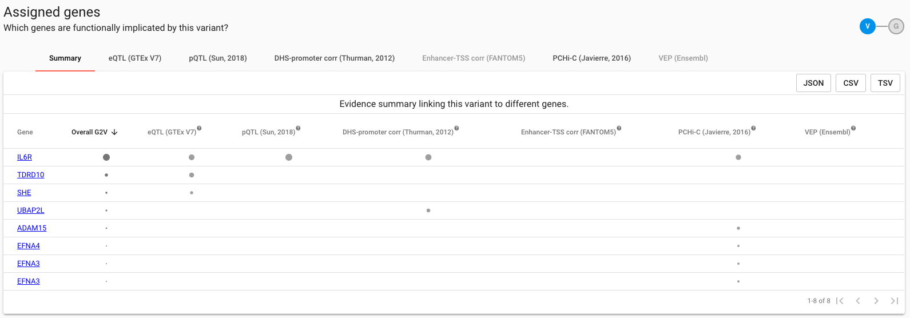

# A Variant


Search by a Variant  or  to:

1. Identify a ranked list of genes which are functionally implicated by the variant
2. View and dissect 

Whether a variant is a lead or tag cannot be specified - simply enter the variant of interest.  There will be slight differences in the returned variant page for lead and tag variants, though.


### You Will See

#### Variant Meta-data

Overall identifying information for the variant, including its rsID if assigned, nearest gene and nearest protein-coding gene according to hg19.  Clicking through the 'View Locus' link will load the Locus View, with the variant preselected.  If the variant is a lead variant in any published study or in UKB sumstats, it will be highlighted on the $$V_L$$ track; otherwise it will be selected as a $$V_T$$entity.  

#### Assigned Genes

Table summarsing the extent of evidence by which the queried variant implicates various genes.  The default view summarises the combined evidence for each gene by each functional data source, collapsed across cell types within the data source.  Overall G2V is a representation of this combined evidence weighting for each gene - sort descending on this column to rank the column from most- to least-likely 'causal' gene at this locus based on the current evidence base in OT Genetics.  

The presence of a bullet \(\) in the table indicates that there is evidence from the given data source linking the gene to the queried variant, in at least one cell type.  The radius of each point is proportionate to the relative magnitude of the maximum effect size across all tissues available for the data source, expressed as a quantile.  Details of how the V2G score is calculated and weighted are shown here.

To view tissue-specific evidence within a data source, select the data source from the tabs along the top of the table widget.  An equivalent view segregated by cell type rather than data source will be opened, as above for eQTL evidence in each of 44 GTEx tissues.  If evidence from the data source being examined can be interpreted directionally,  

