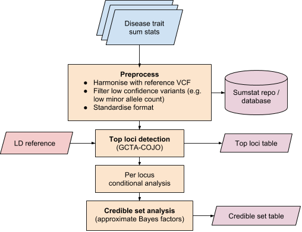

# Assigning Variants to Disease \(V2D\)

### Lead Variant Annotation

Open Targets Genetics is based on the human reference genome assembly GRCh37 maintained by the Genome Reference Consortium. Lead variants, $$V_L$$, associated with a phenotype by hypothesis-free approaches \(GWAS\) are initially annotated with their associated trait\(s\) as described below:


Traits in Open Targets Genetics is assigned in the format `Reported Trait (Author, Year).`  Multiple studies assessing the same trait are _not_ collapsed into a single annotation. This preserves the integrity of the published record and will allow users to select study-specific analyses within the portal.  


#### Published Associations

Reported variant-phenotype associations in literature were identified _via_ the NHGRI-EBI GWAS Catalog, a manually-curated database of published variants meeting certain inclusion criteria, which will be familiar to most geneticists. On an ongoing basis, GWAS Catalog extracts and records detailed variant and study-level data for variants reported to be associated with any phenotype at a significance level of $$p≤1e−5$$, and which fall within the inclusion criteria [detailed here](https://www.ebi.ac.uk/gwas/docs/methods/criteria).

#### UK Biobank Phenotypes

Recent efforts to rapidly and systematically apply established GWAS methods to all available data fields in UKB have made available large repositories of summary statistics. To leverage these data for variant annotation, we used full summary statistics generated by the Neale lab \([Round 1](http://www.nealelab.is/uk-biobank/)\). These analyses applied GWAS \(implemented in [Hail](https://hail.is/)\) to all data fields using imputed genotypes from HRC as released by UK Biobank in May 2017, consisting of 337,199 individuals post-QC. Full details of the Neale lab GWAS implementation are available [here](http://www.nealelab.is/blog/2017/9/11/details-and-considerations-of-the-uk-biobank-gwas).

See the fine-mapping section below for details of how associated-loci were defined using the Neale lab UK Biobank summary statistics.

### Lead Variant to Tag Variant expansion

Two methods are used to expand lead disease-associated variants into a more complete set of possibly _causal_ tag variants. Linkage-disequilibrium expansion using a reference population is applied to all studies in Open Targets Genetics, and expansion by fine-mapping \(credible set analysis\) is used where full summary statistics are available \(currently only Neale lab UK Biobank traits\).

#### Linkage Disequilibrium Expansion

Linkage disequilibrium \(LD\) information is calculated using the 1000 Genomes Phase 3 \(1KG\) haplotype panel as a reference. LD is calculated in the 1KG super-population that most closely matches GWAS study [ancestry information](https://www.ebi.ac.uk/gwas/ancestry) curated by the GWAS Catalog. If the study is conducted in a mixture of populations, a weighted-average \(of Fisher Z-transformed correlation coefficients\) across super-populations is used. If ancestry information is unknown, European ancestry is assumed. See [here](https://github.com/opentargets/v2d_data#ld-table-methods) for full methods.

#### Fine-mapping Expansion

**Summary Statistics Preprocessing**

Summary statistics were harmonised to ensure that the ALT allele is always the effect allele, and were pre-filtered to remove variants with low minor allele counts which would lead to inaccurate effect estimation. Variants located in the MHC region \(6:28,477,797–33,448,354 GRCh37\) are excluded from the fine-mapping pipeline. See [here](https://github.com/opentargets/sumstat_harmoniser) for harmonisation scripts and [here](https://github.com/opentargets/sumstat_data#requirements-when-adding-new-datasets) for fill outline of variant inclusion criteria.

**Top loci detection**

Independently associated top loci are detected with GCTA stepwise selection procedure \(cojo-slct\) using UK10K \(ALSPAC + TwinsUK\) genotypes \(N=3,781\) as an LD reference. Index variants \(the most associated variant at each locus\) are kept if both the conditional and nominal p-values have $$p≤5e^{-8}$$ . 

**Per locus conditional analysis**

Where multiple index SNPs are found at the same locus \(within 500kb of each other\), we perform GCTA single-variant association analysis conditional on other index SNPs at the locus. This produces a set of conditional summary statistics for each independently associated locus.

**Credible set analysis**

Credible set analysis is conducted for each associated locus using the above conditional summary statistics. We calculate an approximate Bayes factors \(ABF\) for all variants in a defined region around the index variant \(±500kb\). ABFs are computed using the `approx.bf.p` [method](https://github.com/chr1swallace/coloc/blob/master/R/claudia.R#L67) re-implemented from the [_coloc_](https://journals.plos.org/plosgenetics/article?id=10.1371/journal.pgen.1004383) package. Variants are ordered by their posterior probabilities \(PP\) and sequentially added to the credible set until the cumulative sum is &gt;0.95 \(95% credible set\).

The implementation of our fine-mapping pipeline can be found [here](https://github.com/opentargets/finemapping).

