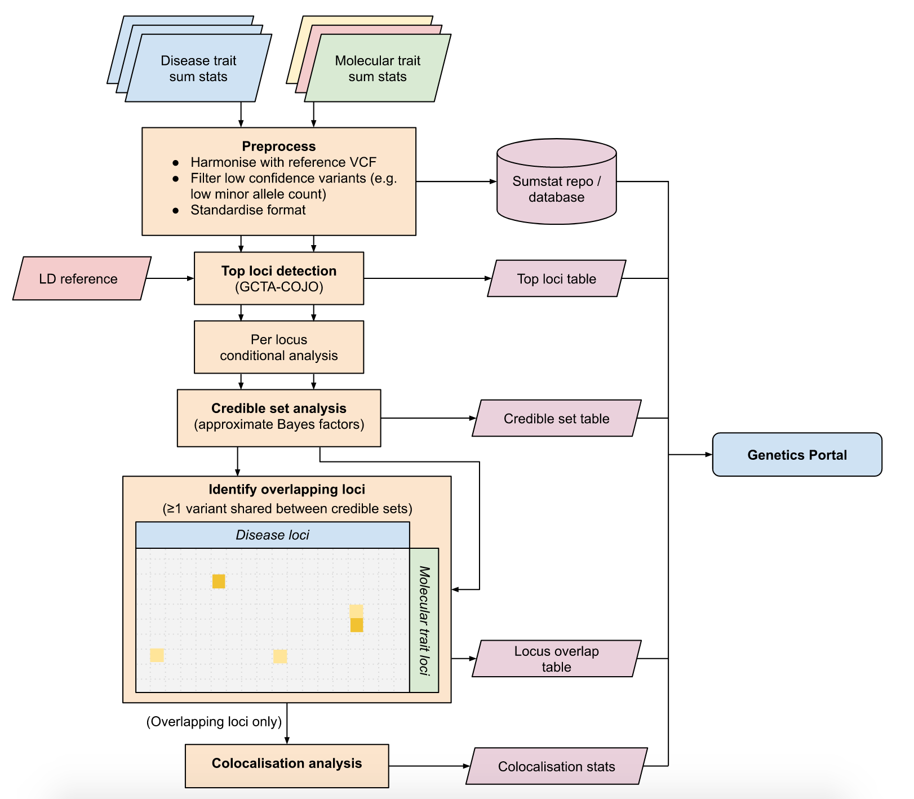

# Colocalisation analysis

Colocalisation analysis is used to test whether two independent association signals at a locus are consistent with having a shared casual variant. If two traits share a causal variant \(they are colocalised\), this increases the evidence that they also share a causal mechanism. For example, if the signal for a disease and protein level \(pQTL\) colocalise, this may provide evidence of a protein’s role in causing the disease.

We use conduct colocalisation analysis using the _coloc_ method \([Giambartolomei _et al._ , 2014](https://www.ncbi.nlm.nih.gov/pubmed/24830394)\). Coloc is a Bayesian method which, for two traits, integrates evidence over all variants at locus to evaluate the following hypotheses:

* H0: No association with either trait
* H1: Association with trait 1, not with trait 2
* H2: Association with trait 2, not with trait 1
* H3: Association with trait 1 and trait 2, two independent SNPs
* H4: Association with trait 1 and trait 2, one shared SNP

Under this framework, evidence for H4 is considered evidence for colocalisation between 2 traits. The implementation of our colocalisation pipeline can be found [here](https://github.com/opentargets/genetics-colocalisation).

### Pipeline overview

**Preprocessing.** Both diseases and molecular trait summary statistics are processed in the same way. However, whilst disease summary statistics are required to have at least minor allele count \(MAC\) &gt; 10, the molecular trait summary statistics are only required to have MAC &gt; 5. This less stringent threshold of selected due to the lower sample sizes.

**Finemapping.** Summary statistics undergo top loci detection, conditional analysis and credible set analysis as outlined [here](assigning-traits-to-loci.md#fine-mapping-expansion). One difference is that molecular trait top loci were kept if the nominal and conditional p-value of the lead variant was p &lt; 0.05 / \(number of variants tested per gene\), as opposed to p &lt; 5e-8.

**Overlap detection**. The overlap between credible sets was be used to identify pairs of signals to conduct a formal colocalisation analysis on. If there is no credible set overlap, it will be assumed that there is no colocalisation between the signals. This help reduce the required computational resources.

**Colocalisation.** Colocalisation was conducted for pairs of signals with at least 1 overlapping variant in their credible sets. The default parameters in _coloc_ were used. Given that we already have prior evidence of colocalisation, we expect these parameter choices to be conservative. Colocalisation was conducted on the conditional set of summary statistics for both disease and molecular traits.

