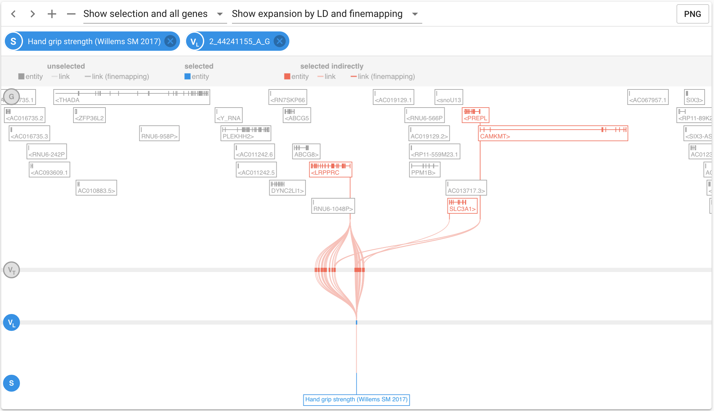
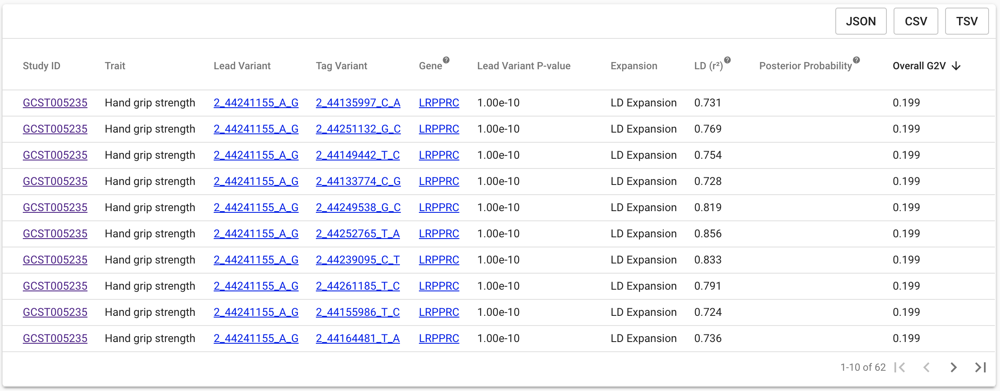

# Introducing the Locus Plot

Many pages in the portal are centred on a new plot designed to effectively summarise the complexity of the links between numerous genes \(targets\), traits, and lead variants.  We call this the Locus Plot.  

The Locus Plot uses a track-style browser to display a locus which can be centred on a gene, variant, or trait of interest \(each known as an **entity**\).  Connecting traits, variants and genes are **evidence strings** which indicate an association or functional link between the entities.  A link indicates that there is at least one element of functional data in at least one cell by which the two entities are associated.  When navigating to the Locus Plot, certain entities will be pre-selected based on context; filters and selections can be altered at any time by clicking an entity or removing it from the applied filters.  

The example below highlights the main features of the plot and should help you familiarise yourself with its concepts.  In this case, one variant from one study has been selected to identify the targets prioritised as functional at this locus.

### Entity Tracks

#### Key Features


The example above shows one lead selected from one study, functionally implicating four genes via one of a number of LD-defined tag variants in at least one data source and cell type.


1. Entities and evidence strings can be coloured grey, red or blue.  
2. Selected entities are indicated on 'chips' at the top of the plot and are highlighted blue.  For any track on which a selection has been applied, the track label will also be illuminated blue
3. Red entities and tracks are those linked to the selected entities by underlying trait or functional annotation, but not actively selected.  They will usually be the main tracks of interest.  
4. Grey entities are those colocated at the locus displayed, but not implicated by Open Targets Genetics.  Grey genes can be hidden from view by using the drop-down at the top of the display.
5. Some entities will be pre-selected when the plot is loaded, based on viewing context.  Any combination of entities can then be selected and managed using the filters.
6. Selecting multiple entities will display the **intersection** of evidence strings containing the selections
7. Selections dynamically update and restrict the **V2G Table**, restricting it to those evidence strings currently being displayed
8. $$V_T$$ in the loci of $$V_L$$ are defined either on LD, or using finemapping approaches if sumstats are available.  Evidence strings which pass _via_ a $$V_T$$ in the credible set are distinguished from those acting via LD-defined  by the colour of the link \(see key\).  Credible sets are re-calculated for every $$V_L $$ -study pairing displayed on the plot.  The logic used to define $$V_T $$ can be restricted to finemapping only using the 'expansion' drop-down, in which case all LD-based $$V_T$$ are hidden.
9. To restrict the credible set finemapping to a single set of summary statistics, the corresponding study must be selected.  Alternatively search the Evidence String Table to identify strings of interest.
10. The locus can be panned and zoomed using the embedded controls \(upper left\)
11. Download a static PNG of the plot for presentation/publication using the PNG link 


In the current version, the Locus Plot only displays links between entities if the evidence strings connects all four entity types.  This means that a variant can only be viewed in the Locus Plot if it has both a trait and a functional annotation.  The Plot will be updated to allow variants with functional but not trait annotation, for example, to be viewed in the next release.


### V2G Table

Each evidence string displayed in the plot is summarised at variant level in the V2G Table, in flat format, with one observation per Study-V\(L\)-V\(T\)-Gene grouping.  The table dynamically displays only those evidence strings currently selected in the Entity Tracks, and can be quickly sorted on any column.

1. Clicking any hyperlinked entity will take you to it's corresponding page in Open Targets Genetics
2. Overall V2G is a scoring of the combined strength of evidence by which a variant functionally implicates a gene across all data sources and cell types in the Open Targets Pipeline.  Sorting on it, as in the above example, will rank the table by prioritised genes across the traits and loci selected, from highest to lowest weight of evidence.
3. LD values shown are between the $$V_L$$ and $$V_T$$ 
4. For fine-mapped variants only, Posterior Probability contains the log\(ABF\) that the $$V_T$$ is the causal variant of the association with the trait in question at this locus 
5. Data in the table as a whole can be dowloaded in a range of structured or flat formats using the corresponding buttons - this may be particularly useful when the table contains many rows.

