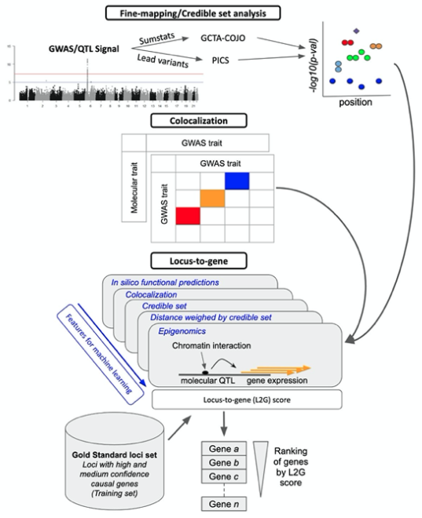
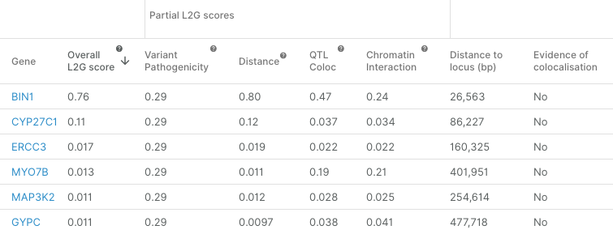

# Prioritising causal genes at GWAS loci \(L2G\)

## Overview

The “locus-to-gene” \(L2G\) model derives features to prioritise likely causal genes at each GWAS locus based on genetic and functional genomics features. The main categories of predictive features are:

* Distance \(from credible set variants to gene\)
* Molecular QTL colocalisation
* Chromatin interaction \(e.g. promoter-capture Hi-C\)
* Variant pathogenicity \(from VEP\)

The L2G model is distinct from the variant-to-gene \(V2G\) pipeline in that it:

* uses a machine-learning model to learn the weights of each evidence source based on a gold standard of previously identified causal genes;
* relies upon fine-mapping and colocalisation data.

Some of the predictive features weight variant-to-gene \(or genomic region-to-gene\) evidence based on the posterior probability that the variant is causal based on fine-mapping of the GWAS association.

Details of the L2G model are provided below, as well as in an upcoming manuscript.

## Gold-standard GWAS gene assignments

To enable supervised machine learning of causal genes at GWAS loci, we manually curated a set of gold standard positive \(GSP\) genes at GWAS loci for which we are confident of the causal gene assignment \(N = 445 in our first release\). The selected genes are based on \(i\) expert domain knowledge of strong orthogonal evidence or biological plausibility; \(ii\) known drug target-disease pairs; \(iii\) experimental alteration from literature reports \(e.g. nucleotide editing\); \(iv\) observational functional data \(e.g. colocalising molecular QTLs, colocalising epigenetic marks, reporter assays\). They are derived from the following sources:

| **Gold-standard source** | **Number of GSP loci in training data** |
| :--- | :--- |
| ChEMBL III | 37 |
| ChEMBL IV | 88 |
| Eric Fauman Twitter | 82 |
| ProGeM | 156 |
| T2D Knowledge Portal | 49 |
| Open Targets Curated | 33 |
| Total | 445 |

The [gold-standard gene repository](https://github.com/opentargets/genetics-gold-standards) is available on GitHub, and is open for community contribution.

## Predictive features

### Variant-centric features

Except for molecular trait colocalisation evidence, each functional genomics dataset is variant-centric, meaning they give variant-to-gene scores. We convert variant-centric scores into locus-to-gene scores by aggregating over credible variants identified through fine mapping. For GWAS studies with summary statistics available we used credible sets from approximate Bayes factor \(ABF\) fine-mapping, otherwise we used LD-based credible sets computed with the PICS method \([Farh et al. 2015](https://pubmed.ncbi.nlm.nih.gov/25363779/)\). We implemented two complementary methods for aggregating over credible sets. Firstly, we took a weighted sum of scores across all variants identified by fine mapping \(PP &gt; 0.01%\) using the posterior probability \(PP of causality as weights \(Equation 1\). Secondly, we took the maximum score for any variant in the 95% credible set

In total, we defined 51 locus-level predictive features based on data from the four evidence categories \(pathogenicity prediction, QTL colocalisation, gene distance, and chromatin interaction\). The datasets that the features are based on are the same as for the V2G pipeline.

Examples of these features are:

* **Aggregated distance** from credible set variants to gene TSS, weighted by variant fine-mapping probability
* **Minimum distance** from credible set variants to gene TSS
* **Relative aggregated distance** for gene X relative to the nearest gene \(by aggregated distance\) at the locus
* **Relative minimum distance** for gene X relative to the nearest gene \(by minimum distance\) at the locus
* **Aggregated distance** from credible set variants to gene **footprint** \(transcription start to end site\), weighted by variant fine-mapping probability
* ...etc.

Similar features are defined within the other evidence categories. In general, we have found that the neighbourhood features are more predictive than the raw / absolute features. For example, in predicting the causal gene, it is more informative to be the nearest gene than it is to be nearer than any fixed distance threshold. Genes are included if any credible set variant is within 500 kb of the canonical transcript for a protein-coding gene, as defined by Ensembl.

### Colocalisation

Molecular trait colocalisation evidence is a locus-centric score. We included both summary statistic derived coloc evidence and LD-derived colocalisation evidence \(based on PICS\) as features. Each GWAS signal may have colocalisation estimates from multiple independent molecular trait signals \(each conditional on the others\), and we therefore took the maximum score across estimates. For functional genomics datasets with measurements in multiple tissues \(or cell types\), we calculated the locus-level feature for each tissue separately and took the maximum across tissues.

Colocalisation for pairs of studies where at least one study lacked summary statistics was done with a heuristic algorithm using the variant probabilities from fine-mapping using PICS. The colocalisation estimate \(equivalent to H4 from the [Giambartolomei coloc method](https://pubmed.ncbi.nlm.nih.gov/24830394/)\) was computed as the sum over the product of variant fine-mapping probabilities between a GWAS and QTL study.

Given that evidence against colocalisation \(H3\) cannot be directly estimated without full summary statistics, this term was dropped for the PICS-derived colocalisation feature.


Although we compute colocalisation using our heuristic algorithm for studies without summary statistics, these data are not publicly exposed in the portal, since they are not directly comparable to values from standard colocalisation methods, and may not be informative at the same score thresholds.


The full table of features is [available here](https://docs.google.com/spreadsheets/d/1tp_nK71SN0FIj7eUbD_k4T5GtZOUT6H7btmH_yL-xsc/edit?usp=sharing).

## Model training

Gold-standard positive \(GSP\) genes were defined as described above. All non-GSP genes in the training data at the locus \(±500kb\) were set as gold-standard negatives \(GSN\). GSNs genes were subsequently removed if they had a stringDB score ≥ 0.7 with the GSP at the same locus, the aim being to remove alternative explanations for the association between trait-associated allele and gene. This resulted in 229 GSNs being removed \(out of a total of 9,171\). A total of 445 GSP were included in the final training data.

We trained an XGBoost gradient boosting classifier, using a binary logistic learning objective function, to distinguish GSP genes from GSNs. Nested cross-validation \(CV\) as implemented in scikit-learn was used to maintain independence of the training and test data and to tune hyperparameters. The outer CV consisted of 5 folds split by chromosomes so that each group contained an approximately equal number of GSPs. Within each fold, we used a random parameter search to train 1000 models, which were assessed using a balanced accuracy metric averaged over 5 randomly split inner folds.

Validation of the model is described in our manuscript introducing the L2G score \(to be published\).

## Interpreting the L2G score

The L2G model produces a score, ranging from 0 to 1, which reflects the approximate fraction of GSP genes among all genes near a given threshold \(Figure 2\). This can be interpreted to say that genes with an L2G score of 0.5 have a 50% chance of being the causal gene at the locus, _under the assumption that the model is correct and the locus itself is similar to those in our gold-standard training data_.

**Note:** Because models don’t generalise perfectly, the true fraction of causal genes at an L2G score of 0.5 is likely to be less than 50%.

A key strength of the L2G score is that it aggregates information over all credible set variants, rather than looking only at the distance from the lead GWAS variant to genes.

### **Feature importance**

The plot below shows the relative importance of the different features in the L2G model.

### Possible bias

The L2G model is trained to identify GSP genes, and hence it will perform well for loci that are very similar to our GSP gene set. It is important to keep in mind that the set of genes currently identified as “causal” is likely to be strongly biased towards those that are nearest to the GWAS peak, for at least the following reasons:

* Genes with high-probability coding variants are more easy to identify as causal, and are generally the nearest gene
* Loci with the strongest effect are more likely to have a coding variant
* Genes near the centre of the GWAS peak are more likely to be investigated and to accumulate evidence for being causal, and be curated as GSP genes

We found very few cases where the L2G score prioritises a distal gene based on QTL or chromatin interaction evidence. As a result, we suspect that the L2G score is biased towards assigning high scores to the nearest genes. \(Although the nearest gene is often causal, there may be additional bias from our GSP dataset.\)

We therefore suggest that it is useful to consider both the L2G score, as well as the underlying QTL and chromatin interaction evidence, in the context of any known gene functions and the biology of a given trait.

### Partial L2G scores

For each category of features included in the main model, we conducted sub-analyses where only that feature group was included. As with the full model, we used these models to assign scores to each gene at each locus based on this “partial” set of features. Partial L2G scores are also in the range 0 to 1.

When looking at the Gene Prioritisation page for a locus, you will see these partial L2G scores in addition to the overall L2G score.

The partial L2G scores are useful to understand how strong the evidence is for a given gene based on a single type of predictor, keeping in mind that these models are using less information than the full model. In some cases the partial L2G score for a given predictor category may be higher than the overall L2G score.

You may notice examples where genes have a nonzero score for a predictor category, for example QTL Coloc, but no colocalisations are shown in the table further down the page. This can occur for studies that lack summary statistics, because the PICS method was used for fine-mapping and subsequent heuristic colocalisation, and these colocalisation values are not displayed in the portal.

The [Locus-to-gene pipeline](https://github.com/opentargets/genetics-l2g-scoring) can be found on GitHub.  

