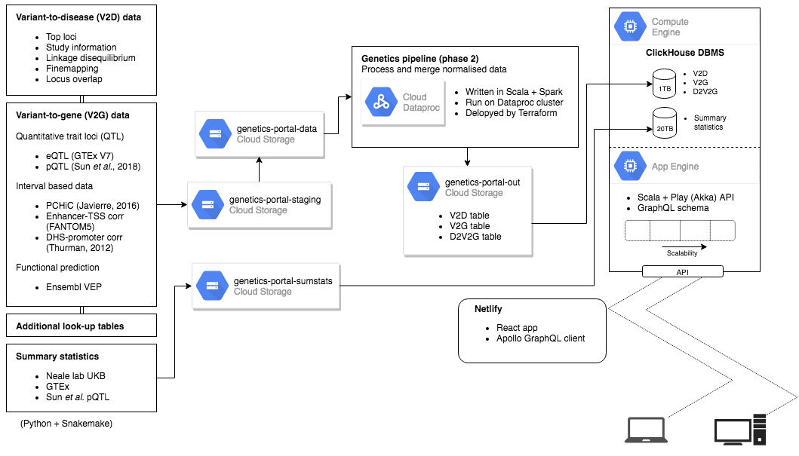
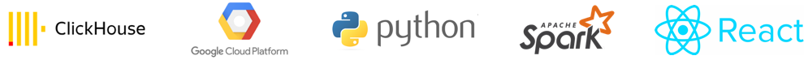

# What Technologies Do We Use?

Phase 1 of the pipeline is to prepare the input data \(V2D, V2G and summary statistics tables\) in a standardised way. Workflows are written in Python and run using Snakemake workflow management system to ensure analyses are reproducible and portable. Workflows are run on on a Google Compute instance, or the Sanger Institute cluster, and the output is stored on Google Cloud Storage \(GCS\).

Phase 2 of the pipeline processes and merges the input data to produce evidence linking traits to variants to genes. This merging pipeline is written in Scala and Spark running on a Google Dataproc cluster, which automatically scales to accommodate the quantity of the data. The output tables are saved in JSON files streamed directly to a Google Cloud Storage _bucket_ before being loaded into a ClickHouse database.

The infrastructure used to serve the data through the _front-end_ by an [API](https://genetics-api.opentargets.io) runs on Google Cloud. It allows to elastically accommodate the unpredictable demand for usage at a global-scale and to keep _DevOps_ operations at minimum levels. Requests are routed by a globally distributed load-balancer to the nearest geo-localised zone; it is currently deployed across 3 main regions: Asia \(north-east\), Europe \(west\) and USA \(east\). In each geo-localised region, the infrastruture decribed below is mantained

* An auto-scalable group of API instances which interprets GraphQL queries and serves the required data from,
* another auto-scalable group of high-performance ClickHouse _DB_ instances, through
* an internal TCP regional load-balancer which makes transparent and high-available the number of ClickHouse nodes running at any period of time.

The API, which also acts as a [playground](http://genetics-api.opentargets.io/graphql/browser?query=%23%20worth%20noting%20the%20number%20of%20associations%0A%23%20shown%20here%20are%20sized%20to%201.%20If%20you%20remove%20that%0A%23%20restriction%20you%20will%20get%20all%20top%20loci%20for%20that%20study%20ID%0Aquery%20exmaple%20%7B%0A%20%20manhattan%28studyId%3A%20%22GCST004131%22%2C%20pageSize%3A%201%29%20%7B%0A%20%20%20%20associations%20%7B%0A%20%20%20%20%20%20variant%20%7B%0A%20%20%20%20%20%20%20%20rsId%0A%20%20%20%20%20%20%20%20chromosome%0A%20%20%20%20%20%20%20%20position%0A%20%20%20%20%20%20%20%20refAllele%0A%20%20%20%20%20%20%20%20altAllele%0A%20%20%20%20%20%20%20%20nearestGene%20%7B%0A%20%20%20%20%20%20%20%20%20%20symbol%0A%20%20%20%20%20%20%20%20%7D%0A%20%20%20%20%20%20%20%20nearestCodingGene%20%7B%0A%20%20%20%20%20%20%20%20%20%20symbol%0A%20%20%20%20%20%20%20%20%7D%0A%20%20%20%20%20%20%7D%0A%20%20%20%20%20%20pval%0A%20%20%20%20%20%20ldSetSize%0A%20%20%20%20%20%20totalSetSize%0A%20%20%20%20%20%20credibleSetSize%0A%20%20%20%20%7D%0A%20%20%20%20topOverlappedStudies%28pageSize%3A%202%29%20%7B%0A%20%20%20%20%20%20topStudiesByLociOverlap%20%7B%0A%20%20%20%20%20%20%20%20study%20%7B%0A%20%20%20%20%20%20%20%20%20%20studyId%0A%20%20%20%20%20%20%20%20%20%20traitReported%0A%20%20%20%20%20%20%20%20%7D%0A%20%20%20%20%20%20%20%20numOverlapLoci%0A%20%20%20%20%20%20%7D%0A%20%20%20%20%7D%0A%20%20%7D%0A%7D%0A) where you can interactively execute GraphQL queries and play with real data, is written in Scala with Play framework using Sangria as a server-side GraphQL implementation.

The front-end is written using the React javascript library and is hosted on Netlify.

